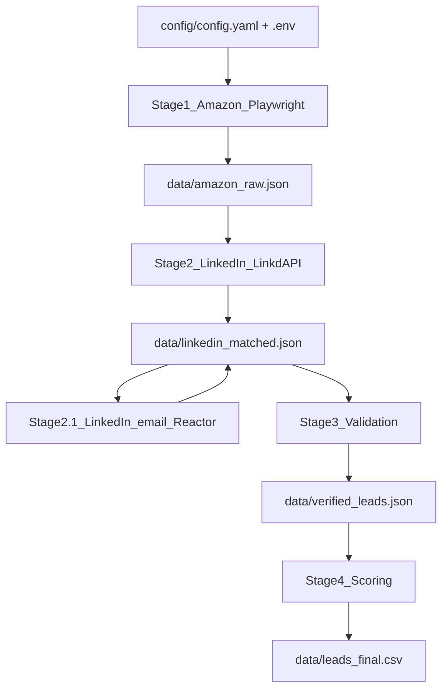

# Author Lead Generation Scraper — Production Architecture (Python 3.12)

**Version:** 1.2 (Playwright-Stealth)  
**Date:** April 14, 2026  
**Amazon scraping:** Playwright + playwright-stealth (local, no third-party proxy API)  
**LinkedIn:** LinkdAPI Python SDK  

## Exact fit criteria (final leads)

Every exported lead must satisfy all criteria from the product spec (high-income professional via LinkedIn, U.S. location, book on Amazon in Pool A or B windows, review bands, low follower count, not heavy creator, etc.). See implementation in `src/stage2_linkedin.py`, `src/stage3_validation.py`, and `src/stage4_scoring.py`.

## High-level pipeline



## Tech stack

| Component | Library / notes |
|-----------|-----------------|
| Amazon | `playwright`, `playwright-stealth` |
| LinkedIn | `linkdapi` |
| Models | Pydantic v2 |
| CSV / tables | pandas |
| Fuzzy match | rapidfuzz |
| CLI | Typer |
| HTTP | httpx (LinkdAPI / utilities) |
| Logs | structlog |
| Config | pydantic-settings + YAML |

One-time: `playwright install chromium`

## Project structure

- `config/config.yaml` — `amazon_scraper`, `linkdapi`, `pipeline`, `scoring`
- `src/stage1_amazon.py` — search + PDP fetch via Playwright
- `src/utils/playwright_amazon.py` — stealth browser session, human-like scroll/delay helpers
- `src/stage2_linkedin.py` — LinkdAPI search + fuzzy match + full profile
- `src/stage3_validation.py` — Amazon re-fetch (Playwright sync), LinkedIn URL check, dedupe
- `src/stage4_scoring.py` — 0–8 scoring, top 10 CSV
- `src/stage21_linkedin_email.py` — Stage 2.1: LinkedIn profile domains + Truth Reactor → updates `linkedin_matched.json`
- `src/main.py` — Typer CLI `--all`, `--stage`, `--force`

## Configuration (`amazon_scraper`)

- `raw_books_json`: basename under `data/` for Stage 1 JSON (default `amazon_raw.json`, replaced when Stage 1 runs)
- `mode`: `"playwright"` (only supported mode)
- `max_pages_per_pool`, `delay_between_pages`, `delay_between_requests`
- `use_headless`, `viewport_width_range`, `viewport_height_range`, `human_scroll_steps`
- `amazon_base`: e.g. `https://www.amazon.com`

## Stage 1 behavior

Uses `Stealth().use_async(async_playwright())` (playwright-stealth v2 API), Chromium with anti-automation launch flags, randomized viewport/locale, extra headers, `domcontentloaded` navigation, jittered sleeps, incremental scrolling, then HTML passed to BeautifulSoup parsers unchanged from earlier versions.

## Stages 2–4

Unchanged in intent: LinkdAPI enrichment with two-factor fuzzy matching, validation and rapidfuzz dedupe, scoring rubric from YAML, CSV columns as specified in the original architecture.

## CLI

```bash
python -m src.main --all
python -m src.main --stage 1
python -m src.main --stage 1 --force
```

## Environment

- `LINKDAPI_KEY` — required when running stages 2, 3, or 4 (or `--all`).
