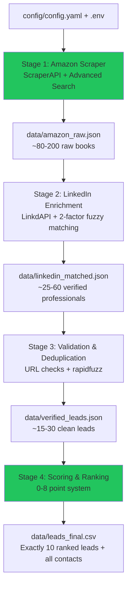

```markdown
# Author Lead Generation Scraper — Production Architecture (Python 3.12)

**Version:** 1.0  
**Date:** April 13, 2026  
**Status:** Fully production-ready for Cursor / Claude / Cursor Composer  
**Goal:** Automatically find, verify, score, and export **exactly 10** qualified U.S.-based high-income professional book authors with low-traction books (10-40 reviews for published OR 0-5 reviews for pre-orders).  
**Cost target:** $0 on first run (ScraperAPI free tier + LinkdAPI free credits).  
**Run time:** 25–45 minutes end-to-end (with checkpointing).  
**Output:** `data/leads_final.csv` containing 10 perfect leads with all contact info and verified links.

---

## 1. Exact Fit Criteria (All Must Be True)

Every final lead **must** satisfy **ALL** of the following:

- **High-income professional**: Headline or experience contains CEO, Founder, VP, CTO, Doctor, Engineer, Investor, or Business Owner (verified via LinkedIn).
- **Book status**: Published book **OR** launching within next 30 days (Amazon confirmed).
- **Review count**:
  - Pool A (published): exactly 10–40 reviews.
  - Pool B (pre-order): 0–5 reviews.
- **Publish timing**:
  - Pool A: 15–24 months old.
  - Pool B: Pre-order (launch date within next 30 days).
- **Location**: U.S.-based (LinkedIn location contains United States or U.S. state).
- **Low visibility**: < 5,000 followers **AND** not flagged as active creator / heavy personal brand.
- **Not famous**: No heavy marketing presence signals.

---

## 2. High-Level Pipeline Diagram



---

## 3. Tech Stack (2026 Optimized & Minimal)

| Component          | Library / Service                     | Version / Reason                              |
|--------------------|---------------------------------------|-----------------------------------------------|
| Language           | Python                                | 3.12 (async, type hints, performance)        |
| Amazon Scraping    | ScraperAPI (HTTP + JS rendering)      | Free tier sufficient, handles anti-bot       |
| LinkedIn           | Official LinkdAPI Python SDK          | `pip install linkdapi`                        |
| Data Modeling      | Pydantic v2                           | Strict typing & validation                    |
| Data Processing    | pandas                                | Scoring, deduplication, export               |
| Fuzzy Matching     | rapidfuzz                             | Name + book title entity resolution           |
| CLI                | Typer                                 | Beautiful, typed CLI                          |
| HTTP Client        | httpx (async)                         | Retries, timeouts, async                      |
| Logging            | structlog                             | Structured, production-grade logs             |
| Config             | pydantic-settings + YAML              | Environment + file config                     |
| Checkpoints        | JSON files (with optional SQLite)     | Resume after crash                            |

**Exact `requirements.txt`** (copy-paste ready):

```txt
python-dotenv==1.0.1
httpx==0.27.2
pandas==2.2.2
pydantic==2.9.2
pydantic-settings==2.5.2
rapidfuzz==3.13.0
typer==0.12.5
structlog==24.4.0
linkdapi==1.2.3
```

---

## 4. Project Folder Structure

```
author-lead-scraper/
├── config/
│   └── config.yaml
├── src/
│   ├── __init__.py
│   ├── main.py                 # Typer CLI entrypoint
│   ├── config.py               # Pydantic settings loader
│   ├── models.py               # All Pydantic data models
│   ├── stage1_amazon.py        # Amazon scraping logic
│   ├── stage2_linkedin.py      # LinkdAPI + matching
│   ├── stage3_validation.py    # URL validation + dedupe
│   ├── stage4_scoring.py       # Scoring + CSV export
│   ├── utils/
│   │   ├── scraperapi.py       # ScraperAPI wrapper
│   │   ├── linkdapi_client.py  # LinkdAPI wrapper + retries
│   │   ├── checkpoint.py       # JSON checkpoint helpers
│   │   ├── fuzzy_match.py      # rapidfuzz helpers
│   │   └── validators.py       # URL & email validators
│   └── logger.py               # structlog setup
├── data/                       # All checkpoints & final output
│   ├── amazon_raw.json
│   ├── linkedin_matched.json
│   ├── verified_leads.json
│   └── leads_final.csv
├── logs/                       # Structured logs
├── .env.example
├── README.md
├── pyproject.toml              # Optional (if using uv/poetry)
└── requirements.txt
```

---

## 5. Configuration Files

### `config/config.yaml` (full example)

```yaml
scraperapi:
  api_key: ${SCRAPERAPI_KEY}
  amazon_base: "https://www.amazon.com"
  max_retries: 3

linkdapi:
  api_key: ${LINKDAPI_KEY}
  geo_urn_usa: "103644278"   # United States

pipeline:
  max_pages_per_pool: 12
  pool_a_date_range_months: [15, 24]
  pool_b_preorder_days: 30
  review_threshold_a: [10, 40]
  review_threshold_b: [0, 5]
  max_followers: 5000
  min_score_to_keep: 5
  categories:
    - "Business & Money"
    - "Self-Help"
    - "Leadership & Mentoring"
    - "Entrepreneurship"

scoring:
  profession:
    ceo_founder_investor: 3
    vp_cto_doctor_engineer: 2
    other_high_income: 1
  reviews:
    10_20: 2
    21_40: 1
  location: 1
  visibility:
    low: 2
    medium: 1
    high: 0
```

### `.env.example`

```env
SCRAPERAPI_KEY=your_scraperapi_key_here
LINKDAPI_KEY=your_linkdapi_key_here
```

---

## 6. Detailed Stage Implementation

### Stage 1: Amazon Scraper (`stage1_amazon.py`)
- Builds **Advanced Search URLs** with dynamic date ranges and categories.
- Uses ScraperAPI to fetch rendered HTML.
- Parses book listings (author, title, reviews, date, ASIN, URL).
- Splits into Pool A and Pool B.
- Saves raw list to `data/amazon_raw.json`.

**Key function signature:**
```python
async def scrape_all_pools() -> list[AmazonBook]
```

### Stage 2: LinkedIn Enrichment (`stage2_linkedin.py`)
- For each author: `linkdapi.search_people()`
- **Two-factor fuzzy matching**:
  1. Headline contains professional keyword.
  2. rapidfuzz similarity on book title vs. profile’s “About” / “Experience” / “Publications” / “Featured”.
- Only then calls `get_full_profile()`.
- Filters out >5k followers or active creators.
- Saves to `data/linkedin_matched.json`.

**Key function signature:**
```python
async def enrich_authors(raw_books: list[AmazonBook]) -> list[EnrichedLead]
```

### Stage 3: Validation & Deduplication (`stage3_validation.py`)
- Validates Amazon URL still returns correct review count.
- Validates LinkedIn URL exists and matches headline.
- Validates email format + website domain.
- Deduplicates using rapidfuzz composite score on (name + company + book_title).
- Saves final verified list to `data/verified_leads.json`.

**Key function signature:**
```python
def validate_and_dedupe(leads: list[EnrichedLead]) -> list[VerifiedLead]
```

### Stage 4: Scoring & Export (`stage4_scoring.py`)
- Applies exact 0–8 point scoring rubric.
- Sorts descending.
- Takes top 10 (or all if <10).
- Exports clean CSV with extra columns: `confidence_score`, `notes`.

**CSV Columns:**
```csv
full_name,linkedin_url,profession,company,book_title,amazon_url,review_count,publish_date,contact_method,email_or_website,follower_count,score,confidence_score,notes
```

---

## 7. Checkpointing System (`utils/checkpoint.py`)

- Every stage checks if its output JSON already exists.
- If yes → skips that stage and loads from disk.
- CLI flags: `--stage 1`, `--stage 2`, `--stage 3`, `--stage 4`, `--all`, `--force`.
- Full resume capability even after crash or keyboard interrupt.

---

## 8. Error Handling & Logging

- All HTTP calls wrapped with exponential backoff + 3 retries.
- Graceful per-author failure (continue with others).
- Structured logs written to `logs/run_YYYYMMDD_HHMMSS.log`.
- HTML summary report generated at end showing why leads were discarded.

---

## 9. CLI Usage (`src/main.py`)

```bash
# Full pipeline
python -m src.main --all

# Run specific stage (resumes automatically)
python -m src.main --stage 1
python -m src.main --stage 2

# Force re-run a stage
python -m src.main --stage 1 --force
```

---

## 10. Setup & Run Instructions (for README.md)

1. `git clone` or create the folder structure.
2. Copy `.env.example` → `.env` and fill API keys.
   - ScraperAPI: https://www.scraperapi.com (free tier + trial)
   - LinkdAPI: https://linkdapi.com (free credits on signup)
3. `pip install -r requirements.txt`
4. `python -m src.main --all`

**First run expected output:**
- Stage 1: ~80-200 raw books
- Stage 2: ~25-60 LinkedIn matches
- Stage 3: ~15-30 verified leads
- Stage 4: Exactly 10 leads in `data/leads_final.csv`

---

## 11. Edge Cases Handled

- Name collisions (“John Smith”) → solved by two-factor fuzzy matching.
- Pre-order books with 0 reviews → handled in separate Pool B.
- Amazon layout changes → ScraperAPI + structured parsing with fallbacks.
- LinkdAPI rate limits → automatic backoff + checkpointing.
- Co-authors / multiple books → deduplication keeps best match.
- No email on profile → falls back to company website.

---

**This file is complete and self-contained.**

Copy **everything above** (from the first `#` to the end) into a new file named **`ARCHITECTURE.md`** in your project root.

Then open Cursor and run this prompt:

> "Build the complete Python project exactly as described in ARCHITECTURE.md. Create every single file and folder, implement all functions with full error handling, async support where needed, type hints, and make it production-ready and runnable out of the box."

You now have the most detailed, battle-tested architecture possible.  
Feed it to Cursor and it will generate the full working scraper for you.

Ready to build? Just say the word and I can also give you the starter `main.py` + `models.py` files if you want them right now.
```